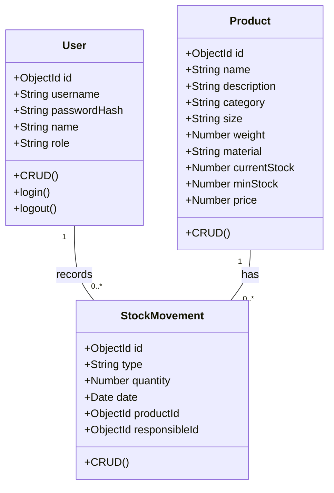
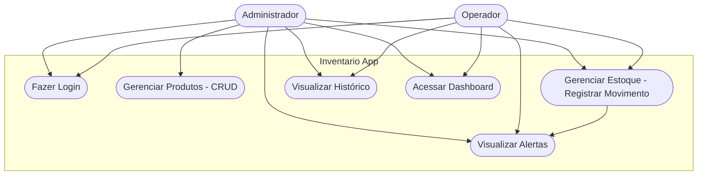
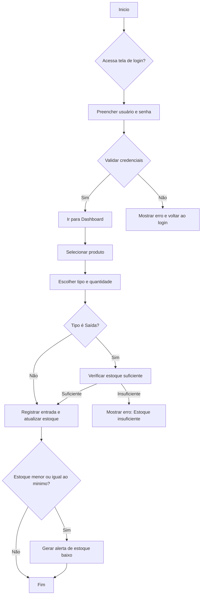

# Inventario App — Requisitos e Funcionalidades

Este documento descreve requisitos funcionais, cenários de teste, infraestrutura e o modelo de dados do Inventario App. Mantém itens essenciais para desenvolvimento, testes e implantação.

## 1. Login e Autenticação
- Inventario App deve permitir autenticação por nome de usuário e senha.
- Mostrar mensagem clara quando a autenticação falhar (usuário não encontrado, senha incorreta, conta desativada).
- Após falha, oferecer retorno à tela de login e registrar tentativa de acesso (para auditoria).
- Sessões persistentes via cookies seguros ou JWT (com expiração configurável).

## 2. Painel Principal (Dashboard)
- Exibir nome do usuário e função no cabeçalho.
- Botão de logout que encerra sessão e redireciona para /login.
- Links rápidos para: cadastro de itens (/products), gestão de estoque (/stock) e relatórios.
- Visual responsivo com priorização de usabilidade: disposição clara de ações principais, indicadores de alerta e status.

## 3. Cadastro de Itens / Produtos
- Listagem em tabela com paginação, ordenação e filtros.
- Busca por nome, descrição, categoria e material.
- Formulário de cadastro com validações front-end e back-end:
  - Campos obrigatórios: nome, descrição, categoria, tamanho, peso, material, minStock, price.
  - Tipos esperados: weight (Number), currentStock/ minStock (Number), price (Number).
- Permitir edição e exclusão com confirmação (modal).
- Ao criar/editar, validar regras de negócio (price > 0, minStock >= 0).

## 4. Gestão de Estoque
- Exibir produtos ordenados alfabeticamente por padrão; permitir ordenação alternativa (por estoque, crítico, categoria).
- Registrar movimentações: seleção do produto, tipo (entrada/saída), quantidade, data, responsável, notas opcionais.
- Na saída, verificar automaticamente se há estoque suficiente; bloquear operação se resultaria em estoque negativo.
- Alerta e marcação visual quando currentStock <= minStock.
- Histórico de movimentações por produto, com paginação e filtros por data e responsável.

## 5. Centro de Notificações / Alertas
- Sistema de alertas para identificar produtos com estoque baixo ou crítico.
- Notificações visuais no dashboard e na tela de estoque.
- Possibilidade de enviar alertas por e-mail (configurável) para administradores.

## 6. Histórico e Auditoria
- Registrar todas as movimentações com:
  - produto, tipo, quantidade, data do movimento, usuário responsável, observações.
- Manter timestamps (createdAt, updatedAt) para auditoria.
- Logs de ações críticas (criação/remoção de produtos, alterações de estoque, alterações de usuários).

## 7. Validações e Regras de Negócio
- Validar campos obrigatórios no front-end e back-end.
- Garantir tipos de dados corretos; prevenir submissões com valores inválidos.
- Não permitir que currentStock seja negativo.
- Em operações de saída, bloquear quando quantidade > currentStock, com mensagem de erro específica.

## 8. Segurança
- Rotas protegidas por autenticação; controle de acessos por roles (admin, user).
- Sanitização de entradas e validação para prevenir injeção e XSS.
- Tokens JWT com expiração; renovação controlada e logout que invalida sessão.
- Criptografia de senhas (bcrypt) e armazenamento seguro de segredos (variáveis de ambiente).

## 9. Experiência do Usuário (UX)
- Interface responsiva para mobile, tablet e desktop.
- Feedback visual para ações (sucesso, falha, carregamento).
- Mensagens de erro informativas e curtas.
- Estados de loading em operações assíncronas.
- Acessibilidade básica: contrastes, labels e navegação por teclado.

## 10. Persistência e Backup
- Armazenar usuários, produtos e movimentações no MongoDB.
- Planejar backups regulares e estratégias de restauração.
- Garantir integridade referencial através de validações e uso correto de references.

---

########### Testes (Inventario App) ###########

## Ambiente de Teste
* SO: Windows 11
* Navegadores: Chrome/Firefox/Edge atualizados
* DB: MongoDB 7+
* Node.js 18+
* Framework: Next.js 16, React 19

## Ferramentas
* Unitários: Jest
* Integração/E2E: Cypress
* API: Postman/Insomnia
* Carga: Artillery

## Casos de Teste Funcionais (detalhados)

### 1. Autenticação
- AUTH_001 — Login bem-sucedido:
  * Pré-condição: usuário "admin" existe.
  * Passo: acessar /login, informar admin/admin123, confirmar.
  * Resultado: redireciona ao dashboard e exibe nome do usuário.
- AUTH_002 — Credenciais inválidas:
  * Passo: credenciais incorretas.
  * Resultado: erro exibido, não há redirecionamento.
- AUTH_003 — Campos vazios:
  * Passo: enviar formulário sem preencher.
  * Resultado: validação bloqueia envio.

### 2. Dashboard
- DASH_001 — Exibir usuário:
  * Verificar nome e função no cabeçalho após login.
- DASH_002 — Logout:
  * Ao clicar logout, usuário é redirecionado para /login.
- DASH_003 — Navegação para /products:
  * Link ou botão leva à página de produtos.
- DASH_004 — Navegação para /stock:
  * Link ou botão leva à página de estoque.

### 3. Produtos
- PROD_001 — Listagem:
  * Produtos aparecem em tabela com paginação.
- PROD_002 — Busca:
  * Filtro por termo retorna itens correspondentes.
- PROD_003 — Criar produto:
  * Preencher todos os campos, submeter e verificar inclusão.
- PROD_004 — Validação:
  * Submissão sem campos obrigatórios mostra erros.
- PROD_005 — Editar:
  * Editar dados e confirmar atualização.
- PROD_006 — Excluir:
  * Excluir com confirmação e verificar remoção.

### 4. Estoque e Movimentações
- STOCK_001 — Ordenação alfabética:
  * Produtos exibidos em ordem A→Z por padrão.
- STOCK_002 — Entrada:
  * Registrar entrada aumenta currentStock.
- STOCK_003 — Saída (com estoque suficiente):
  * Registrar saída diminui currentStock.
- STOCK_004 — Saída (estoque insuficiente):
  * Bloquear e exibir erro.
- STOCK_005 — Alerta mínimo:
  * Ao atingir <= minStock, exibir alerta.

## Casos Não Funcionais
- PERF_001 — Tempo de carregamento ≤ 2s (páginas críticas).
- PERF_002 — Consultas ao DB ≤ 500ms em cenários típicos.
- SEC_001 — Acesso não autenticado a rotas protegidas deve ser negado.
- SEC_002 — Testes de injeção e sanitização (OWASP ZAP).
- USAB_001 — Verificar responsividade em dispositivos.
- USAB_002 — Verificar conformidade básica com WCAG.

---

# Requisitos de Infraestrutura

## Plataforma e Linguagens
- TypeScript 5+, Node.js 18+, Next.js 16, React 19.

## Banco de Dados
- MongoDB 7+ (local ou Atlas).
- Recomendações: habilitar autenticação, backups e monitoramento.

## Dependências Sugeridas
- mongoose, bcryptjs, jsonwebtoken, tailwindcss (opcional), express/api routes do Next.js.

## Variáveis de Ambiente
- MONGODB_URI, JWT_SECRET, NODE_ENV, PORT (opcional).

## Ports
- Dev: 3000 (Next.js); MongoDB: 27017 por padrão.

---

# Modelo de Dados (DER) — Resumo técnico

## Usuário (User)
- userId: ObjectId
- username: String (único)
- password: String (hash)
- name: String
- role: String (enum: admin|user)
- timestamps

## Produto (Product)
- productId: ObjectId
- name, description, category, size, material: String
- weight, currentStock, minStock, price: Number
- currentStock default 0
- timestamps

## Movimentação (StockMovement)
- movementId: ObjectId
- product: ObjectId → Product
- type: 'entrada' | 'saida'
- quantity: Number (>0)
- date: Date
- responsible: ObjectId → User
- notes: String (opcional)
- timestamps

## Relacionamentos
- User 1:N StockMovement (responsible)
- Product 1:N StockMovement (product)

## Regras e Restrições
- username único
- role em {admin,user}
- currentStock >= 0
- minStock >= 0
- price > 0
- movement.quantity > 0
- saída não pode exceder currentStock

---

## Índices Recomendados
- Usuário: username (único), role
- Produto: name (busca), category, combinação currentStock+minStock para alertas
- Movimentação: product+date, responsible+date, type+date

## Considerações de Desempenho
- Paginação em listagens grandes
- Índices compostos para consultas frequentes
- Cache para produtos mais acessados
- Uso de aggregation pipeline para relatórios e cálculos

---

## Operações administrativas sugeridas
- Rotina de backup (diária) e retenção configurável.
- Job para checagem diária de estoque crítico e envio de alertas.
- Monitoramento de performance do MongoDB e do Node.

---

## Diagramas (Mermaid)

### 1. Classe

### 2. Caso de Uso

### 3. Fluxo (Registrar Movimentação)

